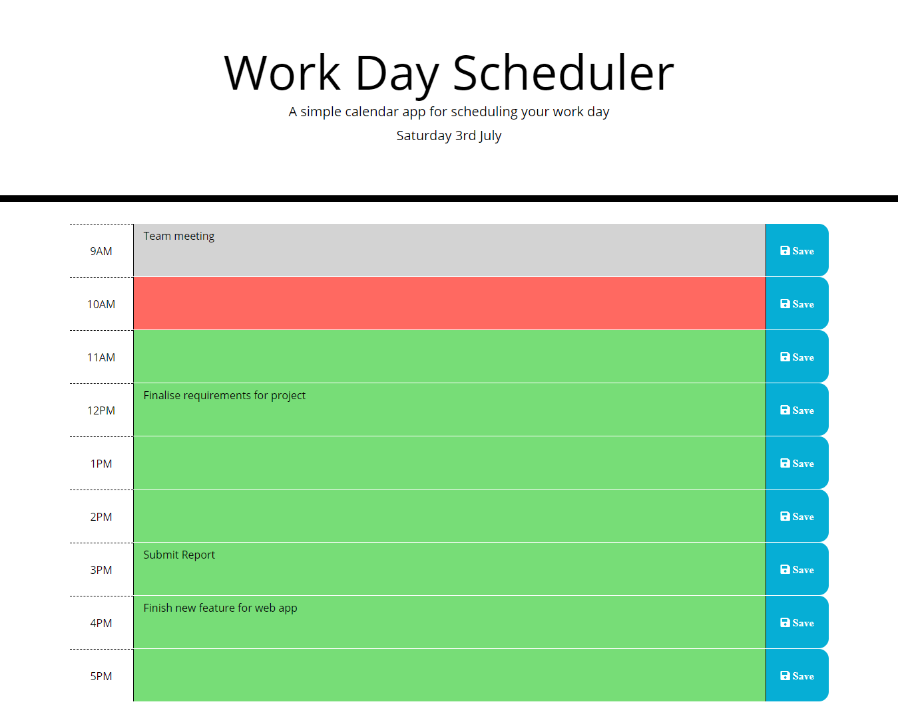

# Weather Dashboard

## Description  

This application uses 3rd Party APIs to add styling to the webpage and also to help write more intuitive JavaScript to interact with the webpage and using these to create a simple day planner to help a person with a busy day manage their workload. Bootstrap was used to add the timeblocks from 9-5 to the webpage and also to style the width of the different sections of the timebox (textarea, button, etc). Moment.js was used to display the current day at the top of the webpage, and jQuery was used to interact with the webpage, fontawesome was used to get a save icon png used to display that you can save entries and a google font is used as our webpage font
  
## Table of Contents  
- [Installation](#installation)
- [Usage](#usage)
- [Credits](#credits)
- [Questions](#questions)
- [License](#license)

## Installation 
No need to install anything, you can use the application as it is hosted at https://kevinjr1998.github.io/Work_Day_Scheduler/

If you wish to install this locally, you can either clone the repo locally and open the html file in you browser or push to GitHub and use GitHub pages to host the webpage. You can also fork the repo and use GitHub pages to deploy the webpage.

## Technologies 
- FontAwesome
- Bootstrap
- jQuery
- Moment.js
- Google Fonts

## Usage

## Credits    
https://github.com/kevinjr1998    
  
## License 
This project is covered under the [MIT](https://opensource.org/licenses/MIT) license

## Tests    
No tests required

## Questions
https://github.com/kevinjr1998

For further questions, please contact me at please contact me at kevinryner@yahoo.co.uk     

